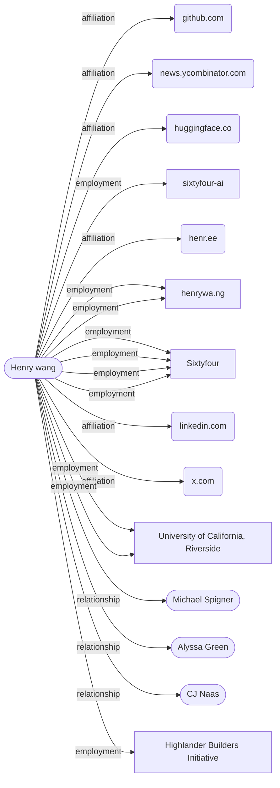

# Henry wang

**CONFIRMED** · NAME_STRONG · identity 0.973 █████

> Input: `Henry wang, sixtyfour ai`

**Advisor** · SF Bay Area

## Summary

- Henry Wang is employed at Sixtyfour (also referenced as sixtyfour-ai), with ongoing employment recorded from February 2026.
- His title at Sixtyfour is listed variously as researcher, software engineer, and founding engineer, representing a conflict in the evidence.
- He is located in the San Francisco Bay Area.
- He has an association with the University of California, Riverside, where titles including Research Assistant Ballard Lab and Data Structures & Algorithms Grader are recorded.
- He holds or has held an advisor role and board or advisor position with the Highlander Builders Initiative, and a title of Founding President is also recorded in connection with that organization.
- His GitHub handle (braindead-dev) was first recorded in May 2023, making that the earliest dated activity in the timeline.
- He can be reached at contact@henrywa.ng and maintains a personal website at henrywa.ng, with an additional website listed as henr.ee.
- Online handles are recorded for LinkedIn, X (Twitter), Hacker News, and Hugging Face.

## Employment

| Value | Dates | Confidence | Source |
|---|---|---|---|
| henrywa.ng | 2026-01-01 → 2026-12-31 | ███░░ 0.67 | [github.com](https://github.com/braindead-dev/wikify) |
| Sixtyfour | — | ████░ 0.83 | [henrywa.ng](https://henrywa.ng/), [linkedin.com](https://www.linkedin.com/in/henry00c) |
| sixtyfour-ai | — | ███░░ 0.60 | [github.com](https://github.com/braindead-dev) |
| University of California, Riverside | — | ██░░░ 0.40 | [linkedin.com](https://linkedin.com/in/henry00c) |
| Highlander Builders Initiative | — | ██░░░ 0.40 | [linkedin.com](https://www.linkedin.com/posts/henry00c_im-happy-to-share-that-ill-be-joining-sixtyfour-activity-7406941322412085249-o8pS) |

## Contact

| Value | Dates | Confidence | Source |
|---|---|---|---|
| https://github.com/braindead-dev | 2023-05-21 → ? | ███░░ 0.67 | [github.com](https://github.com/braindead-dev) |
| contact@henrywa.ng | — | ███░░ 0.67 | [github.com](https://github.com/braindead-dev/wikify) |
| henr.ee | — | ███░░ 0.60 | [github.com](https://github.com/braindead-dev) |
| https://linkedin.com/in/henry00c | — | ███░░ 0.60 | [henrywa.ng](https://henrywa.ng/) |
| https://x.com/henry0284928382 | — | ███░░ 0.60 | [henrywa.ng](https://henrywa.ng/) |
| https://news.ycombinator.com/user?id=henry00c | 2024-09-28 → ? | ██░░░ 0.48 | [news.ycombinator.com](https://news.ycombinator.com/user?id=henry00c) |
| https://huggingface.co/henry00c | — | █░░░░ 0.27 | [huggingface.co](https://huggingface.co/henry00c) |

## Public output

| Value | Dates | Confidence | Source |
|---|---|---|---|
| https://github.com/braindead-dev/wikify | 2026-09-03 → ? | ███░░ 0.67 | [github.com](https://github.com/braindead-dev/wikify) |
| https://github.com/braindead-dev/gpu-box2d | 2026-07-02 → ? | ███░░ 0.67 | [github.com](https://github.com/braindead-dev/gpu-box2d) |

## Notable

| Value | Dates | Confidence | Source |
|---|---|---|---|
| Highlander Builders Initiative | 2025-12-01 → now | ██░░░ 0.48 | [linkedin.com](https://www.linkedin.com/in/henry00c) |
| San Francisco Bay Area (US) | — | ██░░░ 0.40 | [linkedin.com](https://www.linkedin.com/in/henry00c) |
| San Francisco, California | — | ██░░░ 0.40 | [linkedin.com](https://linkedin.com/in/henry00c) |
| San Francisco Bay Area [US] | — | ██░░░ 0.40 | [linkedin.com](https://www.linkedin.com/posts/henry00c_im-happy-to-share-that-ill-be-joining-sixtyfour-activity-7406941322412085249-o8pS) |

## Timeline

| Date | Event | Source |
|---|---|---|
| 2023-05 | handle: https://github.com/braindead-dev | [github.com](https://github.com/braindead-dev) |
| 2024-09 | handle: https://news.ycombinator.com/user?id=henry00c | [news.ycombinator.com](https://news.ycombinator.com/user?id=henry00c) |
| 2025-12 | board_or_advisor: Highlander Builders Initiative | [linkedin.com](https://www.linkedin.com/in/henry00c) |
| 2025-12 | title: Advisor | [linkedin.com](https://www.linkedin.com/in/henry00c) |
| 2025-12 | title: full-stack SWE intern | [linkedin.com](https://www.linkedin.com/posts/henry00c_im-happy-to-share-that-ill-be-joining-sixtyfour-activity-7406941322412085249-o8pS) |
| 2026 | employment: henrywa.ng (ended 2026) | [github.com](https://github.com/braindead-dev/wikify) |
| 2026 | email: contact@henrywa.ng | [github.com](https://github.com/braindead-dev/wikify) |
| 2026-02 | employment: Sixtyfour | [linkedin.com](https://www.linkedin.com/in/henry00c) |
| 2026-07 | repo: https://github.com/braindead-dev/gpu-box2d | [github.com](https://github.com/braindead-dev/gpu-box2d) |
| 2026-09 | repo: https://github.com/braindead-dev/wikify | [github.com](https://github.com/braindead-dev/wikify) |

## How it connects

## Non-obvious findings

Claims whose only source was a specialized pivot — commit email, Wayback, Gravatar, username probe, or a verified reciprocal link.

| Value | Dates | Confidence | Source |
|---|---|---|---|
| https://github.com/braindead-dev | 2023-05-21 → ? | ███░░ 0.67 | [github.com](https://github.com/braindead-dev) |
| henrywa.ng | 2026-01-01 → 2026-12-31 | ███░░ 0.67 | [github.com](https://github.com/braindead-dev/wikify) |
| contact@henrywa.ng | — | ███░░ 0.67 | [github.com](https://github.com/braindead-dev/wikify) |
| https://news.ycombinator.com/user?id=henry00c | 2024-09-28 → ? | ██░░░ 0.48 | [news.ycombinator.com](https://news.ycombinator.com/user?id=henry00c) |
| https://huggingface.co/henry00c | — | █░░░░ 0.27 | [huggingface.co](https://huggingface.co/henry00c) |

## Coverage gaps at stop

| Looked for | Found / target |
|---|---|
| current role corroborated by 2 independent sources | 0 / 1 |
| education | 0 / 1 |
| public output (repos, publications, talks) | 2 / 3 |
| relationships (co-founders, co-authors, colleagues) | 0 / 3 |

## Identity resolution

- math P=0.973 margin=0.76 [anchored_one_way=+1.5; anchor:employer:personal_site=+2.0; corroboration:employer:4src=+0.6; surname:common=+0.2; uniqueness=+0.8]; T1 CONFIRM

| Candidate | Score | Terms |
|---|---|---|
| `c3` ← confirmed | 0.973 | prior -1.5; anchored_one_way +1.5; anchor:employer:personal_site +2.0; corroboration:employer:4src +0.6; surname:common +0.2; uniqueness +0.8 |
| `c5` | 0.214 | prior -1.5; surname:common +0.2 |
| `c6` | 0.214 | prior -1.5; surname:common +0.2 |
| `c7` | 0.214 | prior -1.5; surname:common +0.2 |
| `c8` | 0.214 | prior -1.5; surname:common +0.2 |

- **rejected `c5`** — No evidence linking to Sixtyfour ai; only shares common surname.
- **rejected `c6`** — No evidence linking to Sixtyfour ai; only shares common surname.
- **rejected `c7`** — below gate margin; not in the top candidates shown to T1
- **rejected `c8`** — below gate margin; not in the top candidates shown to T1
- **rejected `c9`** — below gate margin; not in the top candidates shown to T1
- **rejected `c10`** — below gate margin; not in the top candidates shown to T1
- **rejected `c11`** — below gate margin; not in the top candidates shown to T1

## Run

| job | tool calls | cache hits | LLM calls | cost | seconds | stop |
|---|---|---|---|---|---|---|
| `henry-wang-32` | 38 | 0 | 40 | $0.213 | 155.4 | S2 |

_Confidence is ordinal, not frequency-calibrated: 0.9 is more reliable than 0.6, it does not mean 90% correct._
