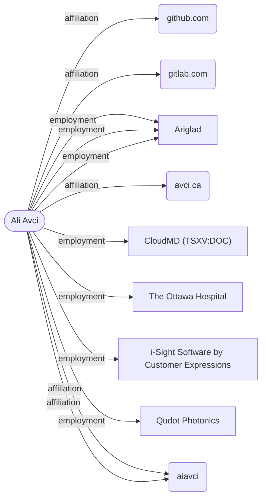

# Ali Avci

**CONFIRMED** · DEFINITE_DESC · identity 0.993 █████

> Input: `do deep research on the CTO of Ariglad`

**CTO and Co-Founder** · Canada

## Summary

- The individual is associated with Ariglad as an employer, and holds the title CTO, also described elsewhere as CTO and Co-Founder.
- The earliest dated activity on record is the creation of the handle https://github.com/aiavci in 2015-04.
- The person uses the handle aiavci, including on GitHub and GitLab, and maintains the website avci.ca.
- Prior employment history includes Senior Software Engineer at CloudMD (TSXV:DOC), Android and Web Developer at The Ottawa Hospital, Enterprise Web Application Developer at i-Sight Software by Customer Expressions, and Computer Vision Mobile App Developer at Qudot Photonics.
- The individual received the 2015 Wib Cowie Innovation Award and has an education record associated with Y Combinator.
- GitHub repositories linked to the handle include workout_companion_app, r-t-components, and basic-socket-io-example.
- An email address, aliavci93@hotmail.com, and a location of Canada are also associated with this individual.

## Employment

| Value | Dates | Confidence | Source |
|---|---|---|---|
| CloudMD (TSXV:DOC) | 2019-06-01 → 2021-01-31 | ██░░░ 0.48 | [ca.linkedin.com](https://ca.linkedin.com/in/aiavci) |
| The Ottawa Hospital | 2017-05-01 → 2018-12-31 | ██░░░ 0.48 | [ca.linkedin.com](https://ca.linkedin.com/in/aiavci) |
| Qudot Photonics | 2016-03-01 → 2017-02-28 | ██░░░ 0.48 | [ca.linkedin.com](https://ca.linkedin.com/in/aiavci) |
| i-Sight Software by Customer Expressions | 2015-11-01 → 2017-05-31 | ██░░░ 0.48 | [ca.linkedin.com](https://ca.linkedin.com/in/aiavci) |
| Ariglad | — | ████░ 0.83 | [github.com](https://github.com/aiavci), [avci.ca](https://avci.ca) |

## Education

| Value | Dates | Confidence | Source |
|---|---|---|---|
| Y Combinator | 2023-01-01 → 2033-12-31 | ██░░░ 0.48 | [ca.linkedin.com](https://ca.linkedin.com/in/aiavci) |

## Contact

| Value | Dates | Confidence | Source |
|---|---|---|---|
| aiavci | — | ████░ 0.83 | [ca.linkedin.com](https://ca.linkedin.com/in/aiavci), [gitlab.com](https://gitlab.com/aiavci) |
| https://github.com/aiavci | 2015-04-04 → ? | ███░░ 0.67 | [github.com](https://github.com/aiavci) |
| aliavci93@hotmail.com | — | ███░░ 0.67 | [github.com](https://github.com/aiavci/workout_companion_app) |
| https://gitlab.com/aiavci | — | ███░░ 0.60 | [gitlab.com](https://gitlab.com/aiavci) |
| avci.ca | — | ███░░ 0.60 | [github.com](https://github.com/aiavci) |

## Public output

| Value | Dates | Confidence | Source |
|---|---|---|---|
| https://github.com/aiavci/workout_companion_app | 2026-08-07 → ? | ███░░ 0.67 | [github.com](https://github.com/aiavci/workout_companion_app) |
| https://github.com/aiavci/r-t-components | 2024-04-23 → ? | ███░░ 0.67 | [github.com](https://github.com/aiavci/r-t-components) |
| https://github.com/aiavci/basic-socket-io-example | 2023-01-12 → ? | ███░░ 0.67 | [github.com](https://github.com/aiavci/basic-socket-io-example) |

## Notable

| Value | Dates | Confidence | Source |
|---|---|---|---|
| CTO@Ariglad | — | ███░░ 0.67 | [github.com](https://github.com/aiavci) |
| 2015 Wib Cowie Innovation Award | 2015-04-01 → 2015-04-30 | ██░░░ 0.48 | [ca.linkedin.com](https://ca.linkedin.com/in/aiavci) |

## Timeline

| Date | Event | Source |
|---|---|---|
| 2015-04 | handle: https://github.com/aiavci | [github.com](https://github.com/aiavci) |
| 2015-04 | award: 2015 Wib Cowie Innovation Award (ended 2015) | [ca.linkedin.com](https://ca.linkedin.com/in/aiavci) |
| 2015-11 | employment: i-Sight Software by Customer Expressions (ended 2017) | [ca.linkedin.com](https://ca.linkedin.com/in/aiavci) |
| 2015-11 | title: Enterprise Web Application Developer (ended 2017) | [ca.linkedin.com](https://ca.linkedin.com/in/aiavci) |
| 2016-03 | employment: Qudot Photonics (ended 2017) | [ca.linkedin.com](https://ca.linkedin.com/in/aiavci) |
| 2016-03 | title: Computer Vision Mobile App Developer (ended 2017) | [ca.linkedin.com](https://ca.linkedin.com/in/aiavci) |
| 2017-05 | employment: The Ottawa Hospital (ended 2018) | [ca.linkedin.com](https://ca.linkedin.com/in/aiavci) |
| 2017-05 | title: Android and Web Developer (ended 2018) | [ca.linkedin.com](https://ca.linkedin.com/in/aiavci) |
| 2019-06 | employment: CloudMD (TSXV:DOC) (ended 2021) | [ca.linkedin.com](https://ca.linkedin.com/in/aiavci) |
| 2019-06 | title: Senior Software Engineer (ended 2021) | [ca.linkedin.com](https://ca.linkedin.com/in/aiavci) |
| 2020-05 | employment: ariglad | [ca.linkedin.com](https://ca.linkedin.com/in/aiavci) |
| 2020-05 | title: CTO and Co-Founder | [ca.linkedin.com](https://ca.linkedin.com/in/aiavci) |
| 2023 | education: Y Combinator (ended 2033) | [ca.linkedin.com](https://ca.linkedin.com/in/aiavci) |
| 2023-01 | repo: https://github.com/aiavci/basic-socket-io-example | [github.com](https://github.com/aiavci/basic-socket-io-example) |
| 2024-04 | repo: https://github.com/aiavci/r-t-components | [github.com](https://github.com/aiavci/r-t-components) |
| 2026 | email: aliavci93@hotmail.com | [github.com](https://github.com/aiavci/workout_companion_app) |
| 2026-08 | repo: https://github.com/aiavci/workout_companion_app | [github.com](https://github.com/aiavci/workout_companion_app) |

## How it connects

## Non-obvious findings

Claims whose only source was a specialized pivot — commit email, Wayback, Gravatar, username probe, or a verified reciprocal link.

| Value | Dates | Confidence | Source |
|---|---|---|---|
| https://github.com/aiavci | 2015-04-04 → ? | ███░░ 0.67 | [github.com](https://github.com/aiavci) |
| aliavci93@hotmail.com | — | ███░░ 0.67 | [github.com](https://github.com/aiavci/workout_companion_app) |
| https://gitlab.com/aiavci | — | ███░░ 0.60 | [gitlab.com](https://gitlab.com/aiavci) |

## Coverage gaps at stop

| Looked for | Found / target |
|---|---|
| relationships (co-founders, co-authors, colleagues) | 0 / 3 |
| notable artifacts (awards, funding, founded, boards) | 1 / 2 |

## Identity resolution

- math P=0.993 margin=0.47 [anchor:employer:code_host=+2.0; corroboration:employer:2src=+0.3; anchor:title:code_host=+1.0; corroboration:title:2src=+0.3; surname:rare=+2.0; uniqueness=+0.8]; T1 CONFIRM

| Candidate | Score | Terms |
|---|---|---|
| `c1` ← confirmed | 0.993 | prior -1.5; anchor:employer:code_host +2.0; corroboration:employer:2src +0.3; anchor:title:code_host +1.0; corroboration:title:2src +0.3; surname:rare +2.0; uniqueness +0.8 |
| `c2` | 0.525 | prior -1.5; surname:rare +2.0; name_form:nickname -0.4 |

- **rejected `c2`** — No evidence linking to Ariglad or CTO title; only a rare surname match, insufficient for identity.

## Run

| job | tool calls | cache hits | LLM calls | cost | seconds | stop |
|---|---|---|---|---|---|---|
| `cto-of-ariglad-13` | 33 | 0 | 24 | $0.112 | 146.6 | S2 |

_Confidence is ordinal, not frequency-calibrated: 0.9 is more reliable than 0.6, it does not mean 90% correct._
