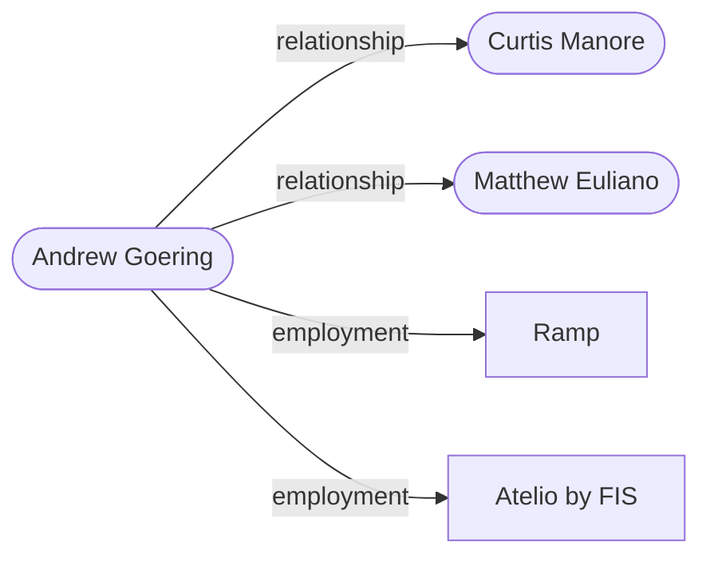

# Andrew Goering

**CONFIRMED** · HARD_ID_EMAIL · identity 0.987 █████

> Input: `andrew.goering@ramp.com`

**Technical Program Manager - Compliance** · Lexington, Massachusetts, United States (US)

## Summary

- Andrew Goering is associated with employment at Ramp.
- He holds the title Technical Program Manager - Compliance, an ongoing role.
- He is also associated with employment at Atelio by FIS.
- He held the title Compliance Manager Senior.
- Another claim lists his employer as ramp.com.
- His location is listed as Lexington, Massachusetts, United States.
- The earliest dated activity is his employment at Atelio by FIS starting 2024-06.

## Employment

| Value | Dates | Confidence | Source |
|---|---|---|---|
| Ramp | 2026-01-01 → now | ██░░░ 0.48 | [linkedin.com](https://www.linkedin.com/in/andrewgoering) |
| Atelio by FIS | 2024-06-01 → 2026-01-31 | ██░░░ 0.48 | [linkedin.com](https://www.linkedin.com/in/andrewgoering) |

## Timeline

| Date | Event | Source |
|---|---|---|
| 2024-06 | employment: Atelio by FIS (ended 2026) | [linkedin.com](https://www.linkedin.com/in/andrewgoering) |
| 2024-06 | title: Compliance Manager Senior (ended 2026) | [linkedin.com](https://www.linkedin.com/in/andrewgoering) |
| 2026-01 | employment: Ramp | [linkedin.com](https://www.linkedin.com/in/andrewgoering) |
| 2026-01 | title: Technical Program Manager - Compliance | [linkedin.com](https://www.linkedin.com/in/andrewgoering) |

## How it connects

## Coverage gaps at stop

| Looked for | Found / target |
|---|---|
| identity anchors (verified handle, email, or site) | 0 / 1 |
| current role corroborated by 2 independent sources | 0 / 1 |
| employment history (3 positions) | 2 / 3 |
| education | 0 / 1 |
| verified contact | 0 / 1 |
| public output (repos, publications, talks) | 0 / 3 |
| relationships (co-founders, co-authors, colleagues) | 0 / 3 |
| notable artifacts (awards, funding, founded, boards) | 0 / 2 |

## Identity resolution

- math P=0.987 margin=0.99 [anchor:employer:professional_network=+1.2; corroboration:employer:2src=+0.3; surname:rare=+2.0; uniqueness=+0.8]; T1 CONFIRM

| Candidate | Score | Terms |
|---|---|---|
| `c1` ← confirmed | 0.987 | prior +0.0; anchor:employer:professional_network +1.2; corroboration:employer:2src +0.3; surname:rare +2.0; uniqueness +0.8 |

## Run

| job | tool calls | cache hits | LLM calls | cost | seconds | stop |
|---|---|---|---|---|---|---|
| `andrew-goering-11` | 17 | 0 | 13 | $0.049 | 63.6 | S_frontier_empty |

_Confidence is ordinal, not frequency-calibrated: 0.9 is more reliable than 0.6, it does not mean 90% correct._
