# Saarth Shah

**CONFIRMED** · NAME_STRONG · identity 0.988 █████

> Input: `Saarth Shah, Sixtyfour`

**co-founder and CEO** · San Francisco, CA

## Summary

- Saarth Shah is the co-founder and CEO of Sixtyfour, a company accepted into Y Combinator's X25 batch.
- He is based in San Francisco, CA.
- His educational background includes UC Berkeley and UCSD's Halıcıoğlu Data Science Institute.
- Prior employment includes Whatnot, Deepgram, Stanford's Snyder Lab, the San Diego Supercomputer Center, and UC San Diego.
- He has also founded Socale and Dart in addition to Sixtyfour.
- A collaborator named Saathvik Dirisala is associated with him.
- The earliest dated activity in the timeline is a PRMO Qualifier award in September 2019.
- His online presence includes profiles on GitHub, LinkedIn, X (Twitter), Hugging Face, and a personal website at www.saarthshah.com.

## Employment

| Value | Dates | Confidence | Source |
|---|---|---|---|
| Whatnot | 2025-01-01 → 2025-03-31 | █████ 0.93 | [saarthshah.com](https://www.saarthshah.com/), [linkedin.com](https://www.linkedin.com/in/saarthshah), [github.com](https://github.com/SaarthShah) |
| Sixtyfour | — | ████░ 0.83 | [saarthshah.com](https://www.saarthshah.com/), [github.com](https://github.com/SaarthShah) |
| Deepgram | — | ████░ 0.83 | [saarthshah.com](https://www.saarthshah.com/), [github.com](https://github.com/SaarthShah) |
| Sixtyfour AI | — | ███░░ 0.60 | [github.com](https://github.com/SaarthShah) |
| Stanford’s Snyder Lab | — | ███░░ 0.60 | [saarthshah.com](https://www.saarthshah.com/) |
| San Diego Supercomputer Center | — | ███░░ 0.60 | [saarthshah.com](https://www.saarthshah.com/) |
| UC Berkeley | — | ███░░ 0.60 | [github.com](https://github.com/SaarthShah) |
| ucsandiego | — | ███░░ 0.60 | [github.com](https://github.com/SaarthShah) |
| Stanford Snyder Lab | — | ███░░ 0.60 | [github.com](https://github.com/SaarthShah) |
| SDSC | — | ███░░ 0.60 | [github.com](https://github.com/SaarthShah) |

## Education

| Value | Dates | Confidence | Source |
|---|---|---|---|
| UC Berkeley | — | ███░░ 0.67 | [saarthshah.com](https://www.saarthshah.com/) |
| UCSD’s Halıcıoğlu Data Science Institute | — | ███░░ 0.67 | [saarthshah.com](https://www.saarthshah.com/) |

## Contact

| Value | Dates | Confidence | Source |
|---|---|---|---|
| https://x.com/saarth_ | — | ████░ 0.83 | [github.com](https://github.com/SaarthShah), [saarthshah.com](https://www.saarthshah.com/) |
| https://github.com/saarthshah | 2020-08-07 → ? | ███░░ 0.67 | [github.com](https://github.com/saarthshah) |
| https://dev.to/saarthshah | — | ███░░ 0.60 | [dev.to](https://dev.to/saarthshah) |
| www.saarthshah.com | — | ███░░ 0.60 | [github.com](https://github.com/SaarthShah) |
| saarth@berkeley.edu | — | ███░░ 0.60 | [github.com](https://github.com/Stanford-Health/wearipedia/blob/28ad9261337ef9ffe3b52121b3b1b597414b022d/CONTRIBUTORS.md) |
| @saarth_ | — | ███░░ 0.60 | [github.com](https://github.com/SaarthShah) |
| https://twitter.com/saarth_ | — | ███░░ 0.60 | [github.com](https://github.com/SaarthShah) |
| https://www.linkedin.com/in/saarthshah/ | — | ███░░ 0.60 | [github.com](https://github.com/SaarthShah) |
| https://www.youtube.com/@saarthshah | — | ██░░░ 0.40 | [youtube.com](https://www.youtube.com/@saarthshah) |
| SaarthShah | — | ██░░░ 0.40 | [linkedin.com](https://www.linkedin.com/in/saarthshah) |
| https://huggingface.co/saarthshah | — | █░░░░ 0.27 | [huggingface.co](https://huggingface.co/saarthshah) |

## Public output

| Value | Dates | Confidence | Source |
|---|---|---|---|
| https://github.com/SaarthShah/blog | 2026-06-22 → ? | ███░░ 0.67 | [github.com](https://github.com/SaarthShah/blog) |
| https://github.com/SaarthShah/mac-meetings-reminder | 2025-11-16 → ? | ███░░ 0.67 | [github.com](https://github.com/SaarthShah/mac-meetings-reminder) |
| https://github.com/SaarthShah/notetaker | 2025-01-25 → ? | ███░░ 0.67 | [github.com](https://github.com/SaarthShah/notetaker) |

## Relationships

| Value | Dates | Confidence | Source |
|---|---|---|---|
| collaborator: Saathvik Dirisala | — | ███░░ 0.67 | [github.com](https://github.com/saathvikpd/PowerOutageCausePrediction/blob/5de208cabbb1ac3b8bf47bfd4ee8835fc49197a6/README.md) |

## Notable

| Value | Dates | Confidence | Source |
|---|---|---|---|
| Sixtyfour | — | ████░ 0.87 | [saarthshah.com](https://www.saarthshah.com/), [github.com](https://github.com/SaarthShah) |
| Co-Founder & CEO @ Sixtyfour (YC X25) \| prev @ UC Berkeley @Whatnot-Inc @deepgram @UCSanDiego  @ Stanford Snyder Lab &  @ SDSC | — | ███░░ 0.67 | [github.com](https://github.com/SaarthShah) |
| Socale | — | ███░░ 0.67 | [saarthshah.com](https://www.saarthshah.com/) |
| Dart | 2024-01-01 → 2024-12-31 | ███░░ 0.67 | [saarthshah.com](https://www.saarthshah.com/) |
| Provost Honors | 2022-01-01 → 2022-01-31 | ██░░░ 0.48 | [linkedin.com](https://www.linkedin.com/in/saarthshah) |
| Hack Harvard 2021 (Most Useless Hack) | 2021-10-01 → 2021-10-31 | ██░░░ 0.48 | [linkedin.com](https://www.linkedin.com/in/saarthshah) |
| AP Scholar | 2020-07-01 → 2020-07-31 | ██░░░ 0.48 | [linkedin.com](https://www.linkedin.com/in/saarthshah) |
| PRMO Qualifier | 2019-09-01 → 2019-09-30 | ██░░░ 0.48 | [linkedin.com](https://www.linkedin.com/in/saarthshah) |

## Timeline

| Date | Event | Source |
|---|---|---|
| 2019-09 | award: PRMO Qualifier (ended 2019) | [linkedin.com](https://www.linkedin.com/in/saarthshah) |
| 2020-07 | award: AP Scholar (ended 2020) | [linkedin.com](https://www.linkedin.com/in/saarthshah) |
| 2020-08 | handle: https://github.com/saarthshah | [github.com](https://github.com/saarthshah) |
| 2021-10 | award: Hack Harvard 2021 (Most Useless Hack) (ended 2021) | [linkedin.com](https://www.linkedin.com/in/saarthshah) |
| 2022-01 | award: Provost Honors (ended 2022) | [linkedin.com](https://www.linkedin.com/in/saarthshah) |
| 2024 | founded: Dart (ended 2024) | [saarthshah.com](https://www.saarthshah.com/) |
| 2025-01 | employment: Whatnot (ended 2025) | [saarthshah.com](https://www.saarthshah.com/) |
| 2025-01 | repo: https://github.com/SaarthShah/notetaker | [github.com](https://github.com/SaarthShah/notetaker) |
| 2025-01 | title: Software Engineer (ended 2025) | [linkedin.com](https://www.linkedin.com/in/saarthshah) |
| 2025-11 | repo: https://github.com/SaarthShah/mac-meetings-reminder | [github.com](https://github.com/SaarthShah/mac-meetings-reminder) |
| 2026-06 | repo: https://github.com/SaarthShah/blog | [github.com](https://github.com/SaarthShah/blog) |

## How it connects

```mermaid
graph LR
  nperson_c2_eea2c9b7(["Saarth Shah"])
  ncompany_sixtyfour_ai_19e809fc["Sixtyfour AI"]
  naccount_www_saarthshah_c_7f8be812("www.saarthshah.com")
  ncompany_sixtyfour_ai_3ca2380c["Sixtyfour"]
  ncompany_deepgram_74a57f5e["Deepgram"]
  ncompany_whatnot_6b2c15c8["Whatnot"]
  naccount_saarth_saarth_e33ca9ad("@saarth_")
  ncompany_uc_berkeley_894a154c["UC Berkeley"]
  ncompany_ucsandiego_f6b706e4["ucsandiego"]
  ncompany_stanford_snyder__885aac21["Stanford Snyder Lab"]
  ncompany_sdsc_06e800f7["SDSC"]
  naccount_twitter_com_http_a17c7aa3("twitter.com")
  naccount_linkedin_com_htt_0a5877df("linkedin.com")
  naccount_x_com_https___x__37effd8a("x.com")
  ncompany_stanford_s_snyde_fb13dd2b["Stanford’s Snyder Lab"]
  ncompany_san_diego_superc_63dfe39b["San Diego Supercomputer Center"]
  ncompany_socale_963a4d96["Socale"]
  ncompany_dart_cced507e["Dart"]
  naccount_saarthshah_saart_38323326("SaarthShah")
  naccount_github_com_https_ddb0f859("github.com")
  naccount_dev_to_https___d_96ab629f("dev.to")
  naccount_huggingface_co_h_b6f477dd("huggingface.co")
  naccount_youtube_com_http_04f28426("youtube.com")
  nperson_unresolved_saathv_537053ba(["Saathvik Dirisala"])
  nperson_c2_eea2c9b7 -->|affiliation| naccount_github_com_https_ddb0f859
  nperson_c2_eea2c9b7 -->|affiliation| naccount_dev_to_https___d_96ab629f
  nperson_c2_eea2c9b7 -->|affiliation| naccount_huggingface_co_h_b6f477dd
  nperson_c2_eea2c9b7 -->|affiliation| naccount_youtube_com_http_04f28426
  nperson_c2_eea2c9b7 -->|employment| ncompany_sixtyfour_ai_19e809fc
  nperson_c2_eea2c9b7 -->|affiliation| naccount_www_saarthshah_c_7f8be812
  nperson_c2_eea2c9b7 -->|affiliation| naccount_x_com_https___x__37effd8a
  nperson_c2_eea2c9b7 -->|ownership| ncompany_sixtyfour_ai_3ca2380c
  nperson_c2_eea2c9b7 -->|employment| ncompany_stanford_s_snyde_fb13dd2b
  nperson_c2_eea2c9b7 -->|employment| ncompany_san_diego_superc_63dfe39b
  nperson_c2_eea2c9b7 -->|ownership| ncompany_socale_963a4d96
  nperson_c2_eea2c9b7 -->|employment| ncompany_deepgram_74a57f5e
  nperson_c2_eea2c9b7 -->|ownership| ncompany_dart_cced507e
  nperson_c2_eea2c9b7 -->|employment| ncompany_whatnot_6b2c15c8
  nperson_c2_eea2c9b7 -->|affiliation| naccount_x_com_https___x__37effd8a
  nperson_c2_eea2c9b7 -->|relationship| nperson_unresolved_saathv_537053ba
  nperson_c2_eea2c9b7 -->|employment| ncompany_whatnot_6b2c15c8
  nperson_c2_eea2c9b7 -->|affiliation| naccount_saarthshah_saart_38323326
  nperson_c2_eea2c9b7 -->|employment| ncompany_sixtyfour_ai_3ca2380c
  nperson_c2_eea2c9b7 -->|affiliation| naccount_saarth_saarth_e33ca9ad
  nperson_c2_eea2c9b7 -->|employment| ncompany_uc_berkeley_894a154c
  nperson_c2_eea2c9b7 -->|employment| ncompany_whatnot_6b2c15c8
  nperson_c2_eea2c9b7 -->|employment| ncompany_deepgram_74a57f5e
  nperson_c2_eea2c9b7 -->|employment| ncompany_ucsandiego_f6b706e4
  nperson_c2_eea2c9b7 -->|employment| ncompany_stanford_snyder__885aac21
  nperson_c2_eea2c9b7 -->|employment| ncompany_sdsc_06e800f7
  nperson_c2_eea2c9b7 -->|affiliation| naccount_twitter_com_http_a17c7aa3
  nperson_c2_eea2c9b7 -->|affiliation| naccount_linkedin_com_htt_0a5877df
```

## Non-obvious findings

Claims whose only source was a specialized pivot — commit email, Wayback, Gravatar, username probe, or a verified reciprocal link.

| Value | Dates | Confidence | Source |
|---|---|---|---|
| https://github.com/saarthshah | 2020-08-07 → ? | ███░░ 0.67 | [github.com](https://github.com/saarthshah) |
| collaborator: Saathvik Dirisala | — | ███░░ 0.67 | [github.com](https://github.com/saathvikpd/PowerOutageCausePrediction/blob/5de208cabbb1ac3b8bf47bfd4ee8835fc49197a6/README.md) |
| https://dev.to/saarthshah | — | ███░░ 0.60 | [dev.to](https://dev.to/saarthshah) |
| saarth@berkeley.edu | — | ███░░ 0.60 | [github.com](https://github.com/Stanford-Health/wearipedia/blob/28ad9261337ef9ffe3b52121b3b1b597414b022d/CONTRIBUTORS.md) |
| https://www.youtube.com/@saarthshah | — | ██░░░ 0.40 | [youtube.com](https://www.youtube.com/@saarthshah) |
| https://huggingface.co/saarthshah | — | █░░░░ 0.27 | [huggingface.co](https://huggingface.co/saarthshah) |

## Coverage gaps at stop

| Looked for | Found / target |
|---|---|
| relationships (co-founders, co-authors, colleagues) | 1 / 3 |

## Identity resolution

- math P=0.988 margin=0.99 [anchored_one_way=+1.5; anchor:employer:personal_site=+2.0; corroboration:employer:4src=+0.6; surname:uncommon=+1.0; uniqueness=+0.8]; T1 CONFIRM

| Candidate | Score | Terms |
|---|---|---|
| `c2` ← confirmed | 0.988 | prior -1.5; anchored_one_way +1.5; anchor:employer:personal_site +2.0; corroboration:employer:4src +0.6; surname:uncommon +1.0; uniqueness +0.8 |

## Run

| job | tool calls | cache hits | LLM calls | cost | seconds | stop |
|---|---|---|---|---|---|---|
| `saarth-shah-4` | 35 | 0 | 28 | $0.174 | 118.2 | S2 |

_Confidence is ordinal, not frequency-calibrated: 0.9 is more reliable than 0.6, it does not mean 90% correct._
